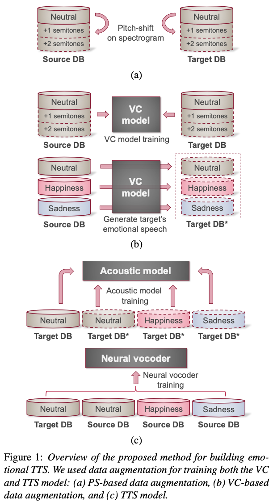
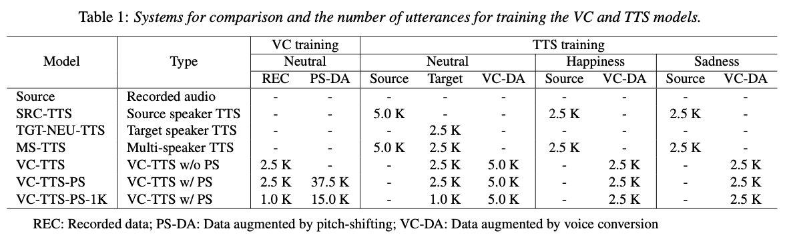

# Authors
- Ryo Terashima
- Ryuichi Yamamoto
- Eunwoo Song
- Yuma Shirahata
- Hyun-Wook Yoon
- Jae-Min Kim
- Kentaro Tachibana

# Paper
- Accepted to Interspeech 2022
- arXiv: [https://arxiv.org/abs/2204.10020](https://arxiv.org/abs/2204.10020)

# Abstruct

Data augmentation via voice conversion (VC) has been successfully applied to low-resource expressive text-to-speech (TTS) when only neutral data for the target speaker are available. Although the quality of VC is crucial for this approach, it is challenging to learn a stable VC model because the amount of data is limited in low-resource scenarios, and highly expressive speech has large acoustic variety. To address this issue, we propose a novel data augmentation method that combines pitch-shifting and VC techniques. Because pitch-shift data augmentation enables the coverage of a variety of pitch dynamics, it greatly stabilizes training for both VC and TTS models, even when only 1,000 utterances of the target speaker’s neutral data are available. Subjective test results showed that a FastSpeech 2-based emotional TTS system with the proposed method improved naturalness and emotional similarity compared with conventional methods.

 

# Demo

## TTS system

- **VC model:** Scyclone \[1\]
- **Acoustic model:** FastSpeech 2 \[2\]
- **Neural vocoder:** Harmonic-plus-noise Parallel WaveGAN \[3\]

## Models

- **Source**: Source speaker's recorded data.
- **SRC-TTS**: Baseline TTS model trained with the source speaker's recordings.
- **TGT-NEU-TTS**: Baseline TTS model trained with the target speaker’s recordings (neutral style alone).
- **MS-TTS**: Baseline multi-speaker TTS model trained with source and target speakers’ recordings.
- **VC-TTS**: Baseline TTS model trained with target speaker’s recordings and VC-augmented data.
- **VC-TTS-PS**: Proposed TTS model trained with target speaker’s recordings and PS-VC-augmented data.
- **VC-TTS-PS-1K**: Proposed TTS model similarly configured with **VC-TTS-PS** system, but trained with a limited amount of recordings.

## Audio samples (Japanese)

### Target speaker's reference

- **Note**: The reference contains the emotional style data of the target speaker, but the VC and TTS training data do not contain the emotional style data of the target speaker.

<audio controls src="./data/samples/ref.wav"></audio> 

### Neutral style

| Model            | Sample 1             | Sample 2            |
|------------------|:--------------------:|:-------------------:|
| **Source**       | <audio controls src="./data/samples/ORG-SRC_neutral/fmkm05059.wav"></audio> | <audio controls src="./data/samples/ORG-SRC_neutral/fmkm05092.wav"></audio> |
| **SRC-TTS**      | <audio controls src="./data/samples/SRC-TTS_neutral/fmkm05059.wav"></audio> | <audio controls src="./data/samples/SRC-TTS_neutral/fmkm05092.wav"></audio> |
| **TGT-NEU-TTS**  | <audio controls src="./data/samples/TGT-TTS_neutral/fmkm05059.wav"></audio> | <audio controls src="./data/samples/TGT-TTS_neutral/fmkm05092.wav"></audio> |
| **MS-TTS**       | <audio controls src="./data/samples/MS-TTS_neutral/fmkm05059.wav"></audio> | <audio controls src="./data/samples/MS-TTS_neutral/fmkm05092.wav"></audio> |
| **VC-TTS**       | <audio controls src="./data/samples/VC-TTS-woda_neutral/fmkm05059.wav"></audio> | <audio controls src="./data/samples/VC-TTS-woda_neutral/fmkm05092.wav"></audio> |
| **VC-TTS-PS**    | <audio controls src="./data/samples/VC-TTS_neutral/fmkm05059.wav"></audio> | <audio controls src="./data/samples/VC-TTS_neutral/fmkm05092.wav"></audio> |
| **VC-TTS-PS-1K** | <audio controls src="./data/samples/VC-TTS-1k_neutral/fmkm05059.wav"></audio> | <audio controls src="./data/samples/VC-TTS-1k_neutral/fmkm05092.wav"></audio> |

### Happiness style

| Model            | Sample 1             | Sample 2            |
|------------------|:--------------------:|:-------------------:|
| **Source**       | <audio controls src="./data/samples/ORG-SRC_cm/fmkm32632.wav"></audio> | <audio controls src="./data/samples/ORG-SRC_cm/fmkm32703.wav"></audio> |
| **SRC-TTS**      | <audio controls src="./data/samples/SRC-TTS_cm/fmkm32632.wav"></audio> | <audio controls src="./data/samples/SRC-TTS_cm/fmkm32703.wav"></audio> |
| **TGT-NEU-TTS**  | <audio controls src="./data/samples/TGT-TTS_neutral_cm/fmkm32632.wav"></audio> | <audio controls src="./data/samples/TGT-TTS_neutral_cm/fmkm32703.wav"></audio> |
| **MS-TTS**       | <audio controls src="./data/samples/MS-TTS_cm/fmkm32632.wav"></audio> | <audio controls src="./data/samples/MS-TTS_cm/fmkm32703.wav"></audio> |
| **VC-TTS**       | <audio controls src="./data/samples/VC-TTS-woda_cm/fmkm32632.wav"></audio> | <audio controls src="./data/samples/VC-TTS-woda_cm/fmkm32703.wav"></audio> |
| **VC-TTS-PS**    | <audio controls src="./data/samples/VC-TTS_cm/fmkm32632.wav"></audio> | <audio controls src="./data/samples/VC-TTS_cm/fmkm32703.wav"></audio> |
| **VC-TTS-PS-1K** | <audio controls src="./data/samples/VC-TTS-1k_cm/fmkm32632.wav"></audio> | <audio controls src="./data/samples/VC-TTS-1k_cm/fmkm32703.wav"></audio> |

### Sadness style

| Model            | Sample 1             | Sample 2            |
|------------------|:--------------------:|:-------------------:|
| **Source**       | <audio controls src="./data/samples/ORG-SRC_sad/fmkm52647.wav"></audio> | <audio controls src="./data/samples/ORG-SRC_sad/fmkm52724.wav"></audio> |
| **SRC-TTS**      | <audio controls src="./data/samples/SRC-TTS_sad/fmkm52647.wav"></audio> | <audio controls src="./data/samples/SRC-TTS_sad/fmkm52724.wav"></audio> |
| **TGT-NEU-TTS**  | <audio controls src="./data/samples/TGT-TTS_neutral_sad/fmkm52647.wav"></audio> | <audio controls src="./data/samples/TGT-TTS_neutral_sad/fmkm52724.wav"></audio> |
| **MS-TTS**       | <audio controls src="./data/samples/MS-TTS_sad/fmkm52647.wav"></audio> | <audio controls src="./data/samples/MS-TTS_sad/fmkm52724.wav"></audio> |
| **VC-TTS**       | <audio controls src="./data/samples/VC-TTS-woda_sad/fmkm52647.wav"></audio> | <audio controls src="./data/samples/VC-TTS-woda_sad/fmkm52724.wav"></audio> |
| **VC-TTS-PS**    | <audio controls src="./data/samples/VC-TTS_sad/fmkm52647.wav"></audio> | <audio controls src="./data/samples/VC-TTS_sad/fmkm52724.wav"></audio> |
| **VC-TTS-PS-1K** | <audio controls src="./data/samples/VC-TTS-1k_sad/fmkm52647.wav"></audio> | <audio controls src="./data/samples/VC-TTS-1k_sad/fmkm52724.wav"></audio> |

# Acknowledgements
This work was supported by Clova Voice, NAVER Corp., Seongnam, Korea.

# References
- \[1\]: Aoi Kanagaki, Masaya Tanaka, Takashi Nose, Ryohei Shimizu, Akira Ito, Akinori Ito, “CycleGAN-based high-quality non-parallel voice conversion with spectrogram and WaveRNN,” in Proc. GCCE, 2020, pp. 356–357.
- \[2\]: Yi Ren, Chenxu Hu, Xu Tan, Tao Qin, Sheng Zhao, Zhou Zhao and Tie-Yan Liu, “FastSpeech 2: Fast and high-quality end-to-end text-to-speech,” In Proc. ICLR, 2021.
- \[3\]: Min-Jae Hwang, Ryuichi Yamamoto, Eunwoo Song and Jae-Min Kim, “High-fidelity Parallel WaveGAN with multi-band harmonic-plus-noise model,” In Proc. INTERSPEECH, 2021.
